# OptimaliQ Visual Architecture Diagram
## Enterprise-Grade AI-Powered Growth Platform

**Document Version:** Visual  
**Last Updated:** 2024-12-19  
**Status:** All Phases Complete (0-8), Production Ready  

---

## 🏗️ **SYSTEM ARCHITECTURE OVERVIEW**

```mermaid
graph TB
    subgraph "🌐 CLIENT LAYER"
        A[User Browser/Device]
        B[Mobile App]
        C[Desktop App]
    end
    
    subgraph "🎨 FRONTEND LAYER"
        D[Next.js 14 App Router]
        E[React 18 + TypeScript]
        F[Tailwind CSS + shadcn/ui]
        G[Framer Motion]
    end
    
    subgraph "🔌 API GATEWAY LAYER"
        H[Next.js API Routes]
        I[Supabase Edge Functions]
        J[External API Integration]
    end
    
    subgraph "🧠 AI ORCHESTRATION LAYER"
        K[AI Router]
        L[Multi-Provider AI]
        M[AI Agents]
        N[RAG Pipeline]
        O[Strategy Engine]
    end
    
    subgraph "⚙️ BUSINESS LOGIC LAYER"
        P[Assessment Engine]
        Q[Growth Intelligence]
        R[Market Intelligence]
        S[Team Collaboration]
    end
    
    subgraph "🗄️ DATA ACCESS LAYER"
        T[Supabase Client]
        U[Database Service]
        V[Real-time Subscriptions]
    end
    
    subgraph "💾 DATA STORAGE LAYER"
        W[PostgreSQL 17.4]
        X[pgvector Extension]
        Y[File Storage]
        Z[Cache Layer]
    end
    
    subgraph "☁️ INFRASTRUCTURE LAYER"
        AA[Vercel Platform]
        BB[Supabase Cloud]
        CC[Monitoring & Analytics]
    end
    
    A --> D
    B --> D
    C --> D
    D --> E
    E --> F
    F --> G
    G --> H
    H --> I
    I --> J
    J --> K
    K --> L
    L --> M
    M --> N
    N --> O
    O --> P
    P --> Q
    Q --> R
    R --> S
    S --> T
    T --> U
    U --> V
    V --> W
    W --> X
    X --> Y
    Y --> Z
    Z --> AA
    AA --> BB
    BB --> CC
    
    style A fill:#e1f5fe
    style D fill:#f3e5f5
    style H fill:#e8f5e8
    style K fill:#fff3e0
    style P fill:#fce4ec
    style T fill:#e0f2f1
    style W fill:#f1f8e9
    style AA fill:#e3f2fd
```

---

## 🔄 **DATA FLOW ARCHITECTURE**

```mermaid
flowchart LR
    subgraph "📱 USER INTERFACE"
        A[User Input<br/>Assessment]
        B[Frontend UI<br/>React Components]
    end
    
    subgraph "🌐 API LAYER"
        C[API Gateway<br/>Next.js Routes]
        D[Authentication<br/>Supabase Auth]
    end
    
    subgraph "🧠 AI PROCESSING"
        E[AI Orchestrator<br/>Multi-LLM Router]
        F[Business Logic<br/>Engines]
        G[AI Agents<br/>Specialized Intelligence]
    end
    
    subgraph "🗄️ DATA LAYER"
        H[Data Service<br/>Supabase Client]
        I[Database<br/>PostgreSQL + pgvector]
        J[Real-time<br/>WebSocket Events]
    end
    
    A --> B
    B --> C
    C --> D
    D --> E
    E --> F
    F --> G
    G --> H
    H --> I
    I --> J
    J --> B
    
    style A fill:#e3f2fd
    style C fill:#e8f5e8
    style E fill:#fff3e0
    style H fill:#fce4ec
```

---

## 🧠 **AI ARCHITECTURE DETAILS**

```mermaid
graph TB
    subgraph "🚀 AI ORCHESTRATION SYSTEM"
        A[AI Router<br/>Intelligent Provider Selection]
        B[Multi-Provider AI<br/>Load Balancing & Fallback]
        C[Strategy Engine<br/>Adaptive AI Behavior]
    end
    
    subgraph "🤖 AI PROVIDERS"
        D[OpenAI GPT-4<br/>Primary: Complex Reasoning]
        E[Anthropic Claude<br/>Safety: Analysis & Compliance]
        F[Google Vertex AI<br/>Cost-effective: Bulk Operations]
        G[Mistral AI<br/>Performance: Fast Responses]
    end
    
    subgraph "🧩 AI AGENTS"
        H[Assessment Agent<br/>Scoring & Branching]
        I[Growth Agent<br/>Planning & Optimization]
        J[Market Agent<br/>Intelligence & Trends]
        K[Delegation Agent<br/>Team Optimization]
        L[Base Agent<br/>Tool Registration & Execution]
    end
    
    subgraph "🔍 RAG PIPELINE"
        M[Content Ingestion<br/>External APIs & News]
        N[Preprocessing<br/>Text Cleaning & Analysis]
        O[Embedding Generation<br/>OpenAI ada-002]
        P[Vector Storage<br/>pgvector Similarity Search]
        Q[Citation Management<br/>Source Tracking]
    end
    
    A --> B
    B --> D
    B --> E
    B --> F
    B --> G
    A --> C
    C --> H
    C --> I
    C --> J
    C --> K
    C --> L
    M --> N
    N --> O
    O --> P
    P --> Q
    
    style A fill:#fff3e0
    style D fill:#e8f5e8
    style H fill:#fce4ec
    style M fill:#e0f2f1
```

---

## 🗄️ **DATABASE ARCHITECTURE**

```mermaid
graph TB
    subgraph "👥 USER MANAGEMENT"
        A[tier2_users<br/>User Profiles & Auth]
        B[tier2_profiles<br/>Assessment Scores]
        C[organizations<br/>Multi-tenant Support]
        D[subscriptions<br/>Billing & Plans]
    end
    
    subgraph "📊 ASSESSMENT SYSTEM"
        E[onboarding_assessments<br/>Raw Assessment Data]
        F[tier2_dashboard_insights<br/>Processed Insights]
        G[assessment_campaigns<br/>Campaign Management]
        H[assessment_assignments<br/>Individual Assignments]
        I[assessment_templates<br/>Configurable Structures]
        J[scoring_rules<br/>Algorithm Configs]
        K[custom_questions<br/>User-defined Questions]
        L[assessment_results<br/>Result Storage]
    end
    
    subgraph "📈 GROWTH INTELLIGENCE"
        M[growth_levers<br/>Actionable Recommendations]
        N[growth_quadrant_data<br/>Positioning Analysis]
        O[growth_lever_progress<br/>Progress Tracking]
        P[benchmark_data<br/>Industry Comparisons]
        Q[growth_scenarios<br/>Scenario Modeling]
        R[action_plans<br/>Strategic Planning]
    end
    
    subgraph "🤝 TEAM COLLABORATION"
        S[team_members<br/>Workspace Participants]
        T[team_workspaces<br/>Team Environments]
        U[collaboration_sessions<br/>Real-time Tracking]
        V[task_assignments<br/>Task Management]
        W[performance_metrics<br/>Performance Tracking]
    end
    
    subgraph "📰 MARKET INTELLIGENCE"
        X[market_articles<br/>RAG Content + Vectors]
        Y[market_snapshots<br/>Cached Insights]
        Z[market_trends<br/>Trend Analysis]
        AA[competitive_intelligence<br/>Competitive Analysis]
        BB[industry_benchmarks<br/>Industry Data]
        CC[market_opportunities<br/>Opportunity Detection]
        DD[risk_assessments<br/>Risk Analysis]
        EE[market_forecasts<br/>Predictive Modeling]
    end
    
    subgraph "🤖 AI & ANALYTICS"
        FF[ai_model_performance<br/>Model Tracking]
        GG[ai_telemetry<br/>Operation Logging]
        HH[user_analytics<br/>User Behavior]
        II[content_analytics<br/>Content Performance]
        JJ[assessment_analytics<br/>Assessment Insights]
        KK[growth_analytics<br/>Growth Tracking]
        LL[market_analytics<br/>Market Metrics]
        MM[system_analytics<br/>System Health]
    end
    
    A --> B
    B --> C
    C --> D
    E --> F
    F --> G
    G --> H
    H --> I
    I --> J
    J --> K
    K --> L
    M --> N
    N --> O
    O --> P
    P --> Q
    Q --> R
    S --> T
    T --> U
    U --> V
    V --> W
    X --> Y
    Y --> Z
    Z --> AA
    AA --> BB
    BB --> CC
    CC --> DD
    DD --> EE
    FF --> GG
    GG --> HH
    HH --> II
    II --> JJ
    JJ --> KK
    KK --> LL
    LL --> MM
    
    style A fill:#e3f2fd
    style E fill:#e8f5e8
    style M fill:#fff3e0
    style S fill:#fce4ec
    style X fill:#e0f2f1
    style FF fill:#f1f8e9
```

---

## 🔐 **SECURITY ARCHITECTURE**

```mermaid
graph TB
    subgraph "🛡️ APPLICATION SECURITY"
        A[Input Validation<br/>Zod Schemas]
        B[Rate Limiting<br/>API Abuse Prevention]
        C[CORS Policy<br/>Cross-origin Control]
        D[Error Handling<br/>Secure Messages]
    end
    
    subgraph "🔑 AUTHENTICATION & AUTHORIZATION"
        E[Supabase Auth<br/>JWT Tokens]
        F[Multi-Factor Auth<br/>2FA Support]
        G[Role-Based Access<br/>Granular Permissions]
        H[SSO Integration<br/>Enterprise Support]
    end
    
    subgraph "🔒 DATA SECURITY"
        I[Row Level Security<br/>79 RLS Policies]
        J[Data Encryption<br/>At-rest & In-transit]
        K[Audit Logging<br/>Activity Tracking]
        L[Data Retention<br/>Configurable Policies]
    end
    
    subgraph "📋 PRIVACY & COMPLIANCE"
        M[GDPR/CCPA Compliance<br/>Consent Management]
        N[PII Protection<br/>Automatic Detection]
        O[Consent Management<br/>Granular Categories]
        P[Data Anonymization<br/>Automatic Cleanup]
    end
    
    A --> B
    B --> C
    C --> D
    E --> F
    F --> G
    G --> H
    I --> J
    J --> K
    K --> L
    M --> N
    N --> O
    O --> P
    
    style A fill:#e8f5e8
    style E fill:#fff3e0
    style I fill:#fce4ec
    style M fill:#e0f2f1
```

---

## 🚀 **PERFORMANCE & SCALABILITY**

```mermaid
graph TB
    subgraph "⏱️ RESPONSE TIME TARGETS"
        A[Dashboard Load<br/>< 2.5 seconds]
        B[API Response<br/>< 800ms p95]
        C[AI Response<br/>< 5s for complex ops]
        D[Database Query<br/>< 100ms average]
    end
    
    subgraph "⚡ OPTIMIZATION STRATEGIES"
        E[Code Splitting<br/>Next.js Optimization]
        F[Caching<br/>Multi-tier Strategy]
        G[Database Optimization<br/>Strategic Indexing]
        H[AI Optimization<br/>Provider Selection]
    end
    
    subgraph "📈 SCALABILITY FEATURES"
        I[Auto-scaling<br/>Vercel Platform]
        J[Database Scaling<br/>Supabase Managed]
        K[CDN Distribution<br/>Global Network]
        L[Load Balancing<br/>AI Provider Routing]
    end
    
    A --> E
    B --> F
    C --> G
    D --> H
    E --> I
    F --> J
    G --> K
    H --> L
    
    style A fill:#e3f2fd
    style E fill:#e8f5e8
    style I fill:#fff3e0
```

---

## 🔄 **REAL-TIME ARCHITECTURE**

```mermaid
graph TB
    subgraph "🔌 WEBSOCKET INFRASTRUCTURE"
        A[Connection Management<br/>Robust Handling]
        B[Event Broadcasting<br/>Real-time Updates]
        C[Message Routing<br/>Efficient Distribution]
        D[Performance Monitoring<br/>Real-time Tracking]
    end
    
    subgraph "⚡ REAL-TIME FEATURES"
        E[Live Chat<br/>Team Collaboration]
        F[Live Updates<br/>Dashboard Refresh]
        G[Notifications<br/>Instant Alerts]
        H[Collaboration<br/>Workspace Updates]
    end
    
    subgraph "📡 EVENT SYSTEM"
        I[Database Triggers<br/>Automatic Events]
        J[WebSocket Events<br/>Client Notifications]
        K[Background Jobs<br/>Async Processing]
        L[Event Logging<br/>Comprehensive Tracking]
    end
    
    A --> B
    B --> C
    C --> D
    E --> F
    F --> G
    G --> H
    I --> J
    J --> K
    K --> L
    
    style A fill:#fff3e0
    style E fill:#e8f5e8
    style I fill:#fce4ec
```

---

## 📊 **MONITORING & OBSERVABILITY**

```mermaid
graph TB
    subgraph "📈 APPLICATION MONITORING"
        A[Performance Tracking<br/>Response Times]
        B[User Analytics<br/>Behavior & Engagement]
        C[Error Tracking<br/>Comprehensive Logging]
        D[Health Checks<br/>System Monitoring]
    end
    
    subgraph "🤖 AI TELEMETRY SYSTEM"
        E[Operation Tracking<br/>Complete AI Logging]
        F[Performance Insights<br/>Success Rates]
        G[Cost Monitoring<br/>Real-time Tracking]
        H[Threshold Tuning<br/>Automated Optimization]
    end
    
    subgraph "🏗️ INFRASTRUCTURE MONITORING"
        I[Database Performance<br/>Query Monitoring]
        J[API Monitoring<br/>Endpoint Performance]
        K[Security Monitoring<br/>Threat Detection]
        L[Business Metrics<br/>KPI Tracking]
    end
    
    A --> E
    B --> F
    C --> G
    D --> H
    E --> I
    F --> J
    G --> K
    H --> L
    
    style A fill:#e3f2fd
    style E fill:#fff3e0
    style I fill:#e8f5e8
```

---

## 🌐 **DEPLOYMENT ARCHITECTURE**

```mermaid
graph TB
    subgraph "🌍 ENVIRONMENT STRATEGY"
        A[Development<br/>Local Supabase]
        B[Staging<br/>Vercel Preview + Staging DB]
        C[Production<br/>Vercel Production + Prod DB]
    end
    
    subgraph "🔄 CI/CD PIPELINE"
        D[GitHub Actions<br/>Automated Testing]
        E[Quality Gates<br/>Linting & Security]
        F[Preview Deployments<br/>Automatic Staging]
        G[Production Deployment<br/>Manual Approval]
    end
    
    subgraph "☁️ INFRASTRUCTURE MANAGEMENT"
        H[Vercel Platform<br/>Edge Network & CDN]
        I[Supabase Cloud<br/>Managed PostgreSQL]
        J[Monitoring<br/>Built-in Performance]
        K[Security<br/>SOC 2 Compliance]
    end
    
    A --> D
    B --> E
    C --> F
    D --> G
    E --> H
    F --> I
    G --> J
    H --> K
    
    style A fill:#e3f2fd
    style D fill:#e8f5e8
    style H fill:#fff3e0
```

---

## 🎯 **KEY ARCHITECTURAL DECISIONS (ADRs)**

```mermaid
graph LR
    subgraph "🏗️ ARCHITECTURAL DECISIONS"
        A[ADR-001<br/>Multi-Provider AI]
        B[ADR-002<br/>Database-First Multi-Tenant]
        C[ADR-003<br/>Type-First Development]
        D[ADR-004<br/>Real-time First]
    end
    
    subgraph "💡 IMPLEMENTATION"
        E[AI Router<br/>Intelligent Selection]
        F[49 Tables<br/>79 RLS Policies]
        G[400+ TypeScript<br/>Interfaces]
        H[WebSocket<br/>Real-time Features]
    end
    
    A --> E
    B --> F
    C --> G
    D --> H
    
    style A fill:#e3f2fd
    style E fill:#e8f5e8
```

---

## 🚀 **TECHNOLOGY STACK SUMMARY**

```mermaid
graph TB
    subgraph "🎨 FRONTEND TECHNOLOGIES"
        A[Next.js 14<br/>App Router]
        B[React 18<br/>TypeScript]
        C[shadcn/ui<br/>Component Library]
        D[Tailwind CSS<br/>Styling]
        E[Framer Motion<br/>Animations]
    end
    
    subgraph "⚙️ BACKEND TECHNOLOGIES"
        F[Node.js<br/>TypeScript]
        G[PostgreSQL 17.4<br/>Database]
        H[Supabase<br/>BaaS Platform]
        I[Next.js API<br/>Routes]
    end
    
    subgraph "🧠 AI & ML TECHNOLOGIES"
        J[OpenAI GPT-4<br/>Primary AI]
        K[Anthropic Claude<br/>Safety AI]
        L[Google Vertex AI<br/>Cost-effective]
        M[Mistral AI<br/>Performance AI]
        N[OpenAI ada-002<br/>Embeddings]
        O[pgvector<br/>Vector Search]
    end
    
    subgraph "☁️ INFRASTRUCTURE & DEVOPS"
        P[Vercel Platform<br/>Hosting]
        Q[Supabase Cloud<br/>Database]
        R[GitHub Actions<br/>CI/CD]
        S[Built-in Monitoring<br/>Observability]
    end
    
    A --> B
    B --> C
    C --> D
    D --> E
    F --> G
    G --> H
    H --> I
    J --> K
    K --> L
    L --> M
    M --> N
    N --> O
    P --> Q
    Q --> R
    R --> S
    
    style A fill:#e3f2fd
    style F fill:#e8f5e8
    style J fill:#fff3e0
    style P fill:#fce4ec
```

---

## 🎉 **IMPLEMENTATION STATUS**

```mermaid
graph LR
    subgraph "✅ COMPLETED PHASES"
        A[Phase 1<br/>Data Modeling & Schema]
        B[Phase 2<br/>AI Infrastructure]
        C[Phase 3<br/>Core API Development]
        D[Phase 4<br/>Frontend Component Library]
        E[Phase 5<br/>Assessment & Growth Engine]
        F[Phase 6<br/>AI Integration & Intelligence]
        G[Phase 7<br/>ML & RAG Implementation]
        H[Phase 8<br/>Team Workspace & Real-time]
    end
    
    subgraph "📊 DELIVERED FEATURES"
        I[49 Database Tables<br/>79 RLS Policies]
        J[60 AI Features<br/>5 Categories]
        K[50+ UI Components<br/>Reusable Library]
        L[100+ API Endpoints<br/>Zod Validation]
        M[Real-time Features<br/>WebSocket Integration]
    end
    
    A --> I
    B --> J
    C --> K
    D --> L
    E --> M
    F --> I
    G --> J
    H --> K
    
    style A fill:#e8f5e8
    style I fill:#fff3e0
```

---

## 🔮 **FUTURE ROADMAP**

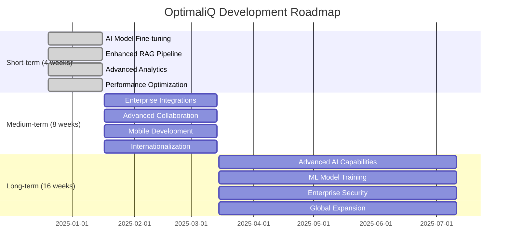

---

## 🎨 **COMPONENT ARCHITECTURE**

```mermaid
graph TB
    subgraph "🎯 ASSESSMENT COMPONENTS"
        A[Assessment Wizard<br/>Dynamic Interface]
        B[Question Renderer<br/>Adaptive Flow]
        C[Progress Indicator<br/>Visual Tracking]
        D[Results Display<br/>Comprehensive Analysis]
    end
    
    subgraph "📊 DASHBOARD COMPONENTS"
        E[Interactive Charts<br/>Real-time Data]
        F[Performance Metrics<br/>KPI Display]
        G[Analytics Widgets<br/>Insight Cards]
        H[Trend Analysis<br/>Visual Trends]
    end
    
    subgraph "🚀 GROWTH STUDIO COMPONENTS"
        I[Growth Levers<br/>Actionable Tools]
        J[Quadrant Analysis<br/>Positioning View]
        K[Scenario Modeling<br/>Planning Interface]
        L[Action Planning<br/>Strategic Tools]
    end
    
    subgraph "🤝 TEAM WORKSPACE COMPONENTS"
        M[Collaboration Chat<br/>Real-time Communication]
        N[Task Management<br/>Assignment Interface]
        O[Performance Tracking<br/>Metrics Display]
        P[Workspace Settings<br/>Configuration]
    end
    
    A --> B
    B --> C
    C --> D
    E --> F
    F --> G
    G --> H
    I --> J
    J --> K
    K --> L
    M --> N
    N --> O
    O --> P
    
    style A fill:#e3f2fd
    style E fill:#e8f5e8
    style I fill:#fff3e0
    style M fill:#fce4ec
```

---

*This visual architecture diagram provides comprehensive visual representations of the OptimaliQ platform architecture using Mermaid diagrams. Each diagram can be rendered as an image and shows different aspects of the system architecture, from high-level system overview to detailed component relationships.*

## 📋 **DIAGRAM USAGE INSTRUCTIONS**

### **Rendering as Images**
1. **Copy Mermaid Code**: Each diagram above contains Mermaid code
2. **Use Mermaid Live Editor**: Visit [mermaid.live](https://mermaid.live)
3. **Paste Code**: Copy the Mermaid code from any diagram above
4. **Export Image**: Use the export feature to save as PNG, SVG, or PDF

### **Integration Options**
- **GitHub**: Mermaid diagrams render automatically in GitHub markdown
- **GitLab**: Native Mermaid support in GitLab markdown
- **Documentation**: Embed in technical documentation
- **Presentations**: Use in PowerPoint or Keynote presentations

### **Customization**
- **Colors**: Modify the style definitions in each diagram
- **Layout**: Adjust the graph direction (TB, LR, RL, BT)
- **Content**: Update text and relationships as needed
- **Formatting**: Modify node shapes and connection styles
