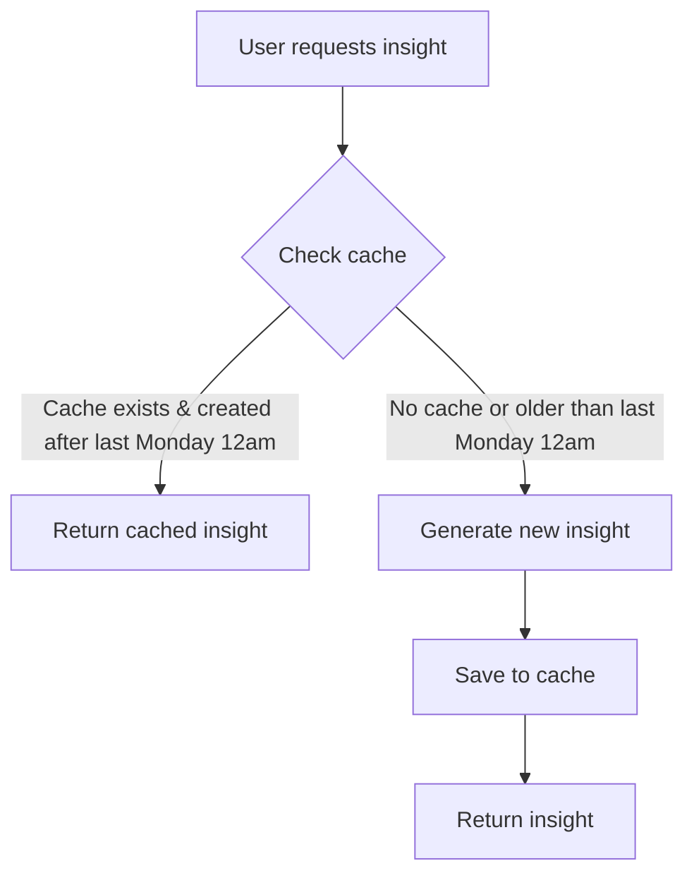
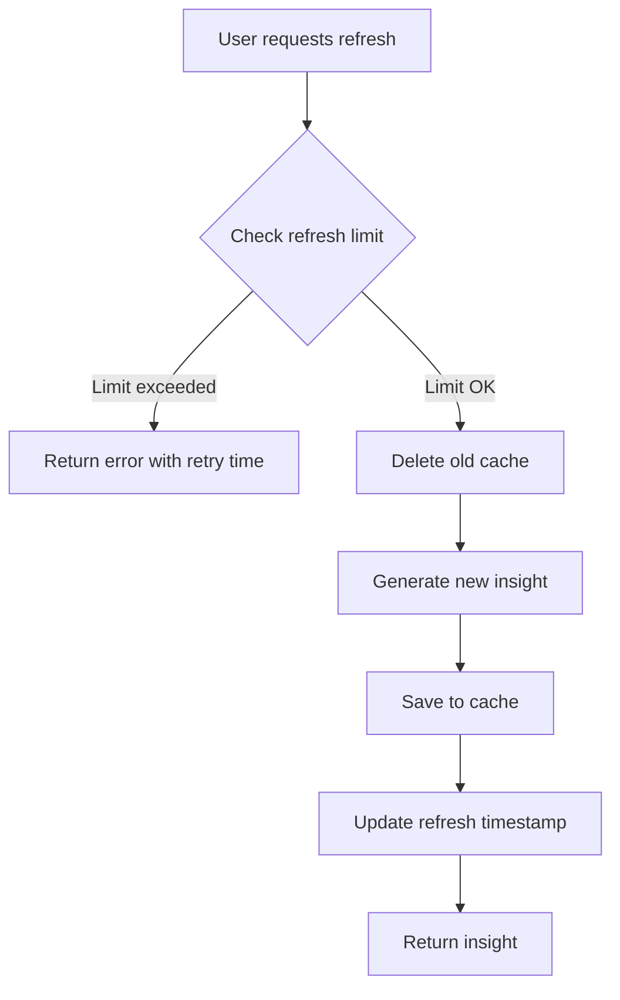

# 🔄 Consistent AI Module Caching System

## Overview

This document describes the unified caching system implemented across all AI analysis modules to ensure consistent behavior, performance optimization, and cost control.

## �� Design Goals

- **Weekly cache refresh** every Monday at 12am for regular insights
- **1-day refresh limit** for manual refreshes to prevent abuse
- **Consistent behavior** across all AI modules
- **Signal score integration** for advanced analytics
- **Supabase persistence** for reliable data storage
- **Rate limiting** to protect against abuse

## 📊 Cached Modules

| Module | Table Name | Cache Duration | Refresh Limit |
|--------|------------|----------------|---------------|
| Enhanced Market Analysis | `market_insights` | Weekly (Monday 12am) | 1 per day |
| Business Trend Analysis | `business_trends` | Weekly (Monday 12am) | 1 per day |
| Engagement Intelligence | `engagement_insights` | Weekly (Monday 12am) | 1 per day |

## 🏗️ Architecture

### Shared Caching Utility (`sharedCaching.ts`)

The `SharedCaching` class provides unified caching functionality:

```typescript
export class SharedCaching {
  // Core caching methods
  async getCachedInsight<T>(userId, industry, tableName): Promise<T | null>
  async saveInsightToCache<T>(userId, industry, insight, tableName, modelVersion, signalScore?, insightMeta?): Promise<void>
  async generateInsightWithCache<T>(userId, industry, tableName, generateFunction, modelVersion, forceRefresh?, signalScore?, insightMeta?): Promise<T>
  
  // Rate limiting methods
  async checkRefreshLimit(userId, industry, tableName): Promise<RefreshLimit>
  async forceRefreshInsight<T>(userId, industry, tableName, generateFunction, modelVersion, signalScore?, insightMeta?): Promise<T>
  
  // Weekly refresh methods
  private getLastMonday12am(): Date
  private isCacheValid(createdAt: Date): boolean
}
```

### Database Schema

Each caching table follows this structure:

```sql
CREATE TABLE table_name (
    id UUID PRIMARY KEY,
    user_id UUID NOT NULL,
    industry TEXT NOT NULL,
    insight_data JSONB NOT NULL,
    model_version TEXT NOT NULL,
    signal_score DECIMAL(5,2),
    insight_meta JSONB,
    created_at TIMESTAMP WITH TIME ZONE DEFAULT NOW(),
    last_refreshed TIMESTAMP WITH TIME ZONE,
    
    CONSTRAINT unique_user_industry UNIQUE (user_id, industry),
    CONSTRAINT signal_score_range CHECK (signal_score >= -100 AND signal_score <= 100)
);
```

## 🔄 Caching Flow

### 1. Regular Load (No Force Refresh)



### 2. Manual Refresh (Force Refresh)



## 📝 API Usage

### Enhanced Market Analysis

```typescript
import { enhancedMarketAnalysis } from './enhancedMarketAnalysis';

// Regular load (uses cache if available)
const insight = await enhancedMarketAnalysis.generateMarketInsightWithCache(
  userId,
  industry,
  userTier
);

// Force refresh (respects rate limits)
const refreshedInsight = await enhancedMarketAnalysis.forceRefreshInsight(
  userId,
  industry,
  userTier
);

// Check if refresh is allowed
const refreshLimit = await enhancedMarketAnalysis.checkRefreshLimit(userId, industry);
```

### Business Trend Analysis

```typescript
import { businessTrendAnalysis } from './businessTrendAnalysis';

// Regular load (uses cache if available)
const trends = await businessTrendAnalysis.generateBusinessTrendsWithCache(
  userId,
  industry,
  userTier
);

// Force refresh (respects rate limits)
const refreshedTrends = await businessTrendAnalysis.forceRefreshBusinessTrends(
  userId,
  industry,
  userTier
);
```

### Engagement Intelligence

```typescript
import { engagementIntelligenceAnalysis } from './engagementIntelligenceAnalysis';

// Regular load (uses cache if available)
const insight = await engagementIntelligenceAnalysis.generateEngagementInsightWithCache(
  userId,
  industry,
  userTier
);

// Force refresh (respects rate limits)
const refreshedInsight = await engagementIntelligenceAnalysis.forceRefreshEngagementInsight(
  userId,
  industry,
  userTier
);
```

## 🎛️ Configuration

### Cache Duration

```typescript
const REFRESH_LIMIT_HOURS = 24; // Manual refresh limit

// Weekly refresh logic
private getLastMonday12am(): Date {
  // Returns the last Monday at 12am (midnight)
}

private isCacheValid(createdAt: Date): boolean {
  // Returns true if cache was created after last Monday 12am
}
```

### Signal Score Integration

All modules store signal scores and metadata:

```typescript
interface CachedInsight {
  signal_score?: number;        // -100 to 100
  insight_meta?: {              // Additional metadata
    signalFactors: SignalFactors;
    signalData: SignalData;
  };
}
```

## 🔒 Security & Performance

### Row Level Security (RLS)

All caching tables have RLS enabled with policies:

- Users can only access their own cached insights
- Automatic cleanup of old data (30+ days)
- Proper indexing for performance

### Rate Limiting

- **1 refresh per day per user per industry**
- Automatic retry-after calculation
- Graceful error handling

### Performance Optimizations

- Database indexes on `(user_id, industry)`, `created_at`, `last_refreshed`
- JSONB storage for flexible insight data
- Efficient cache invalidation

## 🚀 Benefits

### Cost Optimization
- **Reduced AI API calls** through intelligent weekly caching
- **Predictable refresh schedule** every Monday at 12am
- **Smart refresh limits** prevent abuse

### User Experience
- **Faster response times** for cached insights
- **Consistent behavior** across all modules
- **Clear feedback** on refresh limits
- **Predictable weekly updates** for fresh insights

### Business Intelligence
- **Weekly trend analysis** aligns with business cycles
- **Consistent data freshness** across all users
- **Cost-effective insights** with controlled refresh frequency 